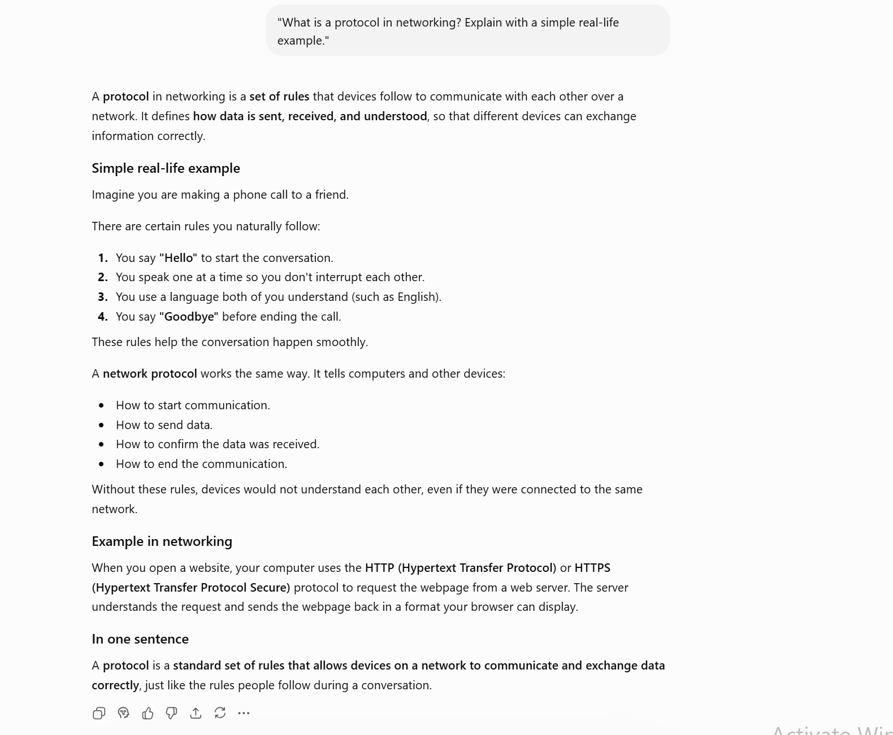
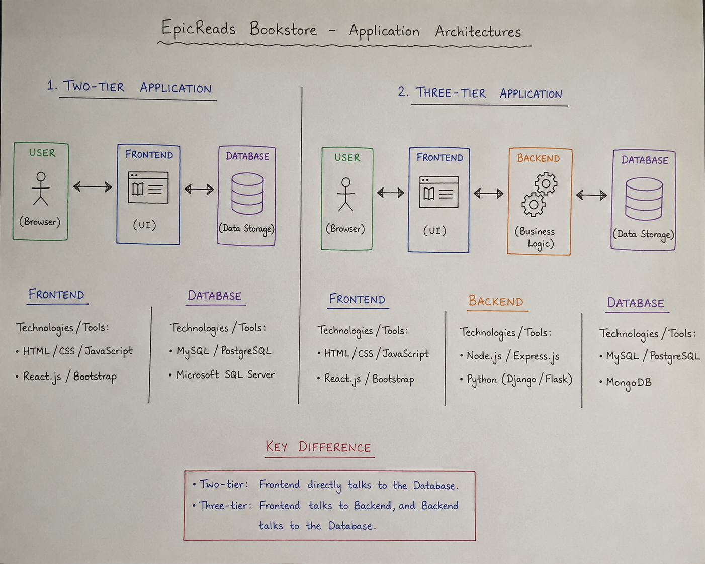
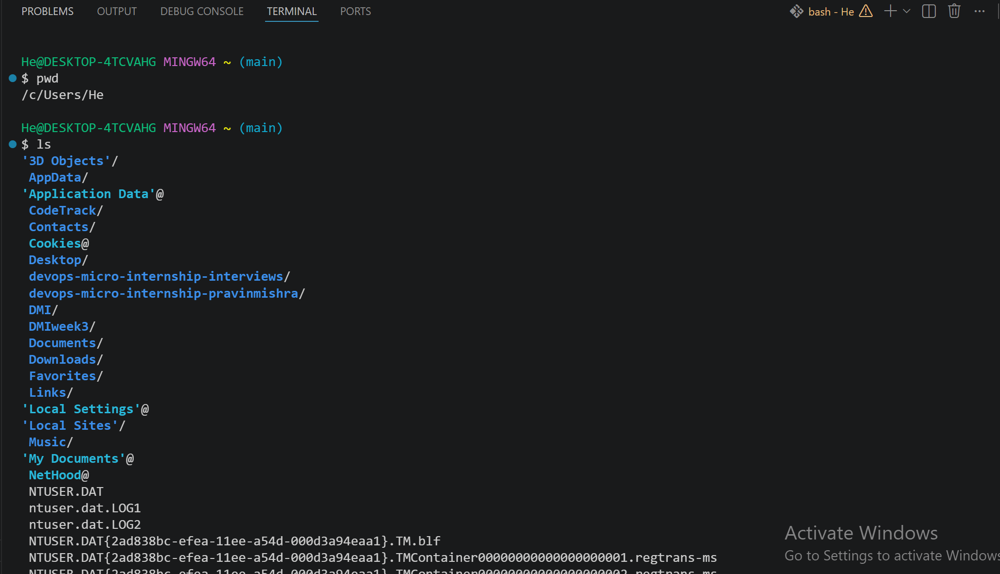

# Week 00 - Internet and Networking

Part of the DevOps Micro Internship (DMI) Cohort 3 with Agentic AI

---

# 🧑‍💻 Task 1: Using ChatGPT as Your Learning Assistant

## Scenario

You're new to DevOps and will frequently encounter technical questions. ChatGPT can be your learning companion.

## Your Task

Write a clear ChatGPT prompt to help you understand:

> "What is a protocol in networking? Explain with a simple real-life example."

Take a screenshot of your interaction showing:

* Your detailed prompt (with clear expectations)
* ChatGPT's simplified response with an example

## Screenshot

Save your screenshot in the `screenshots` folder and update the file name below.




Replace `task-1-chatgpt.png` with your actual screenshot file name.

---

## What I Learned (2–3 lines)

**What I Learned:**

I learned that a **network protocol** is a set of rules that allows devices to communicate and exchange data correctly. I also understood that protocols are like the rules people follow in a conversation, ensuring communication is clear, organized, and successful.

---

# 🌐 Task 2: Internet and Networking

## Scenario

Your friend is launching an online bookstore named **EpicReads**.

He asked you to explain how users globally can access his website hosted in Finland.

## Your Task

Write a short explanation (**100–150 words**) that includes:

* Packet Switching
* IP Address
* TCP/IP
* HTTP/HTTPS

💡 **Tip:** You may use ChatGPT (as demonstrated in Task 1) to refine your explanation.

## Answer

When a user visits the **EpicReads** website, their browser sends a request using **HTTP** or the more secure **HTTPS** protocol. The request is broken into smaller pieces called **packets** through **packet switching**, allowing the data to travel efficiently across different network paths. Each packet contains the **IP address** of the user's device and the server hosting EpicReads in Finland, ensuring it reaches the correct destination. The **TCP/IP** protocol suite manages the communication by routing the packets, checking for errors, and reassembling them in the correct order when they arrive. This process happens within seconds, allowing readers from anywhere in the world to access EpicReads quickly, securely, and reliably.

---

# 🏗️ Task 3: Application Architecture & Stack

## Scenario

EpicReads bookstore has two application versions:

### Two-Tier Application

* Frontend
* Database

### Three-Tier Application

* Frontend
* Backend
* Database

## Your Task

* Draw simple diagrams (hand-drawn or tool-based such as draw.io)
* Label each layer clearly
* List at least two common technologies or tools used for each layer
* Submit a screenshot or photo clearly showing your own drawing

## Diagram Screenshot / Photo

Save your diagram image in the `screenshots` folder and update the file name below.




Replace `task-3-diagram.png` with your actual diagram file name.

---

## Technologies Used

### Frontend

* HTML, CSS, JavaScript
* React.js

### Backend

* Node.js
* Express.js

### Database

* MySQL
* PostgreSQL

---

# 🌍 Task 4: Domain Name & DNS (Basic Concepts)

## Scenario

Your friend's bookstore **EpicReads** is currently accessible through:

```text
52.172.142.222:3000
```

He purchased the domain:

```text
epicreads.com
```

## Your Task

In **50–100 words**, explain in your own words:

1. What is DNS (Domain Name System)?
2. Which DNS record type should be used to connect the domain to the given IP, and why?

## Answer

The Domain Name System (DNS) is like the internet's phonebook. It translates a domain name, such as epicreads.com, into an IP address that computers use to locate the website. To connect epicreads.com to the server at 52.172.142.222, an A (Address) record should be used because it maps a domain name directly to an IPv4 address. This allows users to access the website using the easy-to-remember domain name instead of typing the server's IP address.

---

# 💻 Task 5: Visual Studio Code Setup (Hands-on)

## Your Task

Install Visual Studio Code (if not already installed).

Take a screenshot of your VS Code environment showing:

* Terminal open inside VS Code
* Running a basic command:

### Windows

```powershell
dir
```

### Linux / macOS

```bash
pwd
ls
```

* Your selected VS Code theme clearly visible

⚠️ **Important:** The screenshot must show your username or another identifiable detail to confirm it is your environment.

## Screenshot

Save your screenshot in the `screenshots` folder and update the file name below.




Replace `task-5-vscode.png` with your actual screenshot file name.

---

# 🔗 Task 6: Publish Your Assignment as a LinkedIn Post

## Objective

Publishing on LinkedIn helps you:

* Build your professional online presence
* Reinforce your learning
* Document your DevOps journey publicly

## Your Task

Summarize your answers from Tasks 1–5 into a LinkedIn post.

Clearly structure your post into the following sections:

* ChatGPT
* Internet & Networking
* App Architecture
* DNS
* VS Code Setup

Add the following credit note at the end of your post:

> **P.S. This post is part of the DevOps Micro Internship (DMI) with Agentic AI — Cohort 3 — by Pravin Mishra. My graded progress is public: https://dmi.pravinmishra.com/s/YOUR-GITHUB-USERNAME.html · Start your DevOps journey: https://dmi.pravinmishra.com/?utm_source=student&utm_medium=ps-linkedin&utm_campaign=cohort3**

---

## LinkedIn Post URL

Paste your LinkedIn post URL here:

https://www.linkedin.com/posts/millicent-anadi-b7b93a175_devops-agenticai-cloudengineering-activity-7440652283496984576-8Btx?utm_source=share&utm_medium=member_desktop&rcm=ACoAACmbeQ8Bk7IWiCzNrTecawWZMBxbCmmmG5E

```

---

## LinkedIn Post Backup Copy

Paste the full text of your LinkedIn post here:

🚀 DevOps Micro-Internship with Agentic AI – Key Highlights

As part of my ongoing DevOps micro-internship leveraging Agentic AI, I’ve been reinforcing core concepts across networking, architecture, and development workflows.

1️⃣ ChatGPT 
Integrating AI tools into my workflow to streamline problem-solving, accelerate debugging, and simulate real-world DevOps scenarios.

2️⃣ Internet & Networking
Revisited how protocols enable structured communication between systems, with TCP/IP and HTTP forming the backbone of reliable data exchange across networks.

3️⃣ Application Architecture
Worked with both:

Two-tier architecture (Frontend + Database)
Three-tier architecture (Frontend + Backend + Database)
Highlighting the importance of separation of concerns for scalability, security, and maintainability.

4️⃣ DNS (Domain Name System)
Explored domain-to-IP resolution and practical configuration using A records to map domains (e.g., epicreads.com) to server endpoints.

5️⃣ VS Code Setup
Utilized the integrated terminal for environment navigation and command-line operations (pwd, ls), a fundamental part of efficient DevOps workflows.

💡 Continuously refining practical skills while integrating AI-driven efficiency into everyday engineering tasks.

P.S. This post is part of the DevOps Micro Internship Cohort run by Pravin Mishra. You can start your DevOps journey for free from his YouTube Playlist. https://lnkd.in/ekhSzKH3

#DevOps hashtag#AgenticAI hashtag#CloudEngineering hashtag#Networking hashtag#TechGrowth

---

# Reflection – Week 0

### What did you find easy?

**What did you find easy?**

I found it easy to understand the basic networking concepts, such as protocols, packet switching, IP addresses, and DNS. I also found it straightforward to identify the different layers in two-tier and three-tier application architectures and the technologies commonly used in each layer.

---

### What was difficult?

**What was difficult?**

Understanding how all the networking concepts work together in real-world applications was the most challenging part. It also took some time to understand how DNS, TCP/IP, HTTP/HTTPS, and packet switching interact to allow users to access a website from anywhere in the world.

---

### What will you improve next week?

**What will you improve next week?**

Next week, I will improve my understanding of networking concepts by practicing more hands-on exercises. I also plan to strengthen my knowledge of application architectures, DNS, and web communication protocols so I can apply these concepts more confidently in real-world projects.

---

## 📌 About DMI & CloudAdvisory

DevOps Micro Internship (DMI) is a project-based DevOps program run by Pravin Mishra (The CloudAdvisory) focused on real-world execution, systems thinking, and career readiness.

It helps learners build strong DevOps foundations with hands-on experience.


## 📌 Resources

- 🌐 **DMI Official Website:** https://dmi.pravinmishra.com?utm_source=github&utm_medium=readme  
- 🎓 **University:** https://university.pravinmishra.com?utm_source=github&utm_medium=readme  
- 💬 **Discord Community:** https://discord.pravinmishra.com?utm_source=github&utm_medium=readme  
- 📝 **Blog:** https://dmi.pravinmishra.com/blog?utm_source=github&utm_medium=readme  
- ▶️ **YouTube Playlist (DMI Cohort 3):** https://www.youtube.com/playlist?list=PLFeSNDtI4Cho  
- 🔗 **Pravin Mishra (LinkedIn):** https://www.linkedin.com/in/pravin-mishra-aws-trainer/  
- 🏢 **CloudAdvisory (LinkedIn):** https://www.linkedin.com/company/thecloudadvisory/

---

*This submission is part of DevOps Micro Internship (DMI) Cohort 3 — Agentic AI Track*