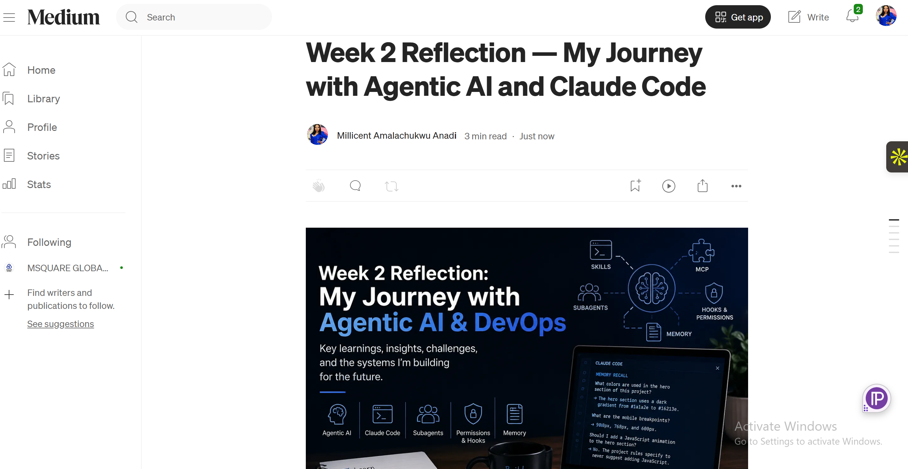
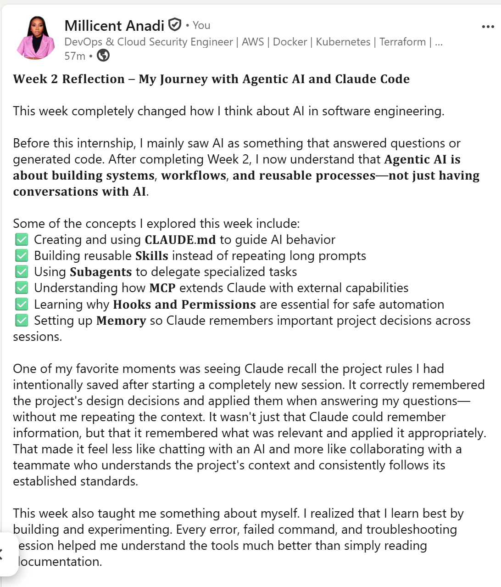

# Assignment 8 — Week 2 Reflection Blog

Part of the DevOps Micro Internship (DMI) Cohort 3 with Agentic AI

---

# Purpose

In this assignment, you will reflect on your Week 2 learning journey and write a short blog capturing your experience working with Agentic AI tools such as Claude Code, Skills, Subagents, MCP, Hooks, Permissions, and Memory.

You will also publish a LinkedIn post summarizing your learning and share both links for evaluation.

---

# Task 1 — Write Your Reflection Blog

## Goal

Write a reflection blog covering your Week 2 learning experience.

### Blog Requirements

Your blog must include:

* Title: **Reflection – Week 2**
* Minimum 300 words
* At least 2–3 topics from Week 2 (Claude Code, Skills, Subagents, MCP, Hooks, Permissions, Memory)
* Honest personal reflection (learning, challenges, mindset)
* One habit/system you plan to implement
* Your full name clearly visible

### Allowed Platforms

You can publish your blog on:

* Hashnode
* Medium
* Dev.to
* LinkedIn Article
* GitHub Markdown file
* Substack

---

### Evidence

#### Screenshot 1 — Blog published and visible



---

### Submission Field

Blog Link:

https://medium.com/@miandicloud/week-2-reflection-my-journey-with-agentic-ai-and-claude-code-8285a814f008

---

# Task 2 — Create LinkedIn Post

## Goal

Share your Week 2 learning publicly on LinkedIn.

---

### LinkedIn Post Requirements

Your post must include:

* One screenshot from any Week 2 assignment
* Short reflection (what you learned or built)
* Required P.S. line exactly as given below

---

### Required P.S. Line (Must Include Exactly)

> **P.S. This post is part of the DevOps Micro Internship (DMI) with Agentic AI — Cohort 3 — by [Pravin Mishra](https://www.linkedin.com/in/pravin-mishra-aws-trainer/). My graded progress is public: https://dmi.pravinmishra.com/s/YOUR-GITHUB-USERNAME.html · Start your DevOps journey: https://dmi.pravinmishra.com/?utm_source=student&utm_medium=ps-linkedin&utm_campaign=cohort3**

---

### Suggested Hashtags

#DMIByPravinMishra #AgenticAI #ClaudeCode #DevOps #LearningInPublic

---

### Evidence

#### Screenshot 2 — LinkedIn post published



---

### Submission Field

LinkedIn Post Content (copy-paste here):

```
𝐖𝐞𝐞𝐤 𝟐 𝐑𝐞𝐟𝐥𝐞𝐜𝐭𝐢𝐨𝐧 – 𝐌𝐲 𝐉𝐨𝐮𝐫𝐧𝐞𝐲 𝐰𝐢𝐭𝐡 𝐀𝐠𝐞𝐧𝐭𝐢𝐜 𝐀𝐈 𝐚𝐧𝐝 𝐂𝐥𝐚𝐮𝐝𝐞 𝐂𝐨𝐝𝐞

This week completely changed how I think about AI in software engineering.

Before this internship, I mainly saw AI as something that answered questions or generated code. After completing Week 2, I now understand that 𝐀𝐠𝐞𝐧𝐭𝐢𝐜 𝐀𝐈 𝐢𝐬 𝐚𝐛𝐨𝐮𝐭 𝐛𝐮𝐢𝐥𝐝𝐢𝐧𝐠 𝐬𝐲𝐬𝐭𝐞𝐦𝐬, 𝐰𝐨𝐫𝐤𝐟𝐥𝐨𝐰𝐬, 𝐚𝐧𝐝 𝐫𝐞𝐮𝐬𝐚𝐛𝐥𝐞 𝐩𝐫𝐨𝐜𝐞𝐬𝐬𝐞𝐬—𝐧𝐨𝐭 𝐣𝐮𝐬𝐭 𝐡𝐚𝐯𝐢𝐧𝐠 𝐜𝐨𝐧𝐯𝐞𝐫𝐬𝐚𝐭𝐢𝐨𝐧𝐬 𝐰𝐢𝐭𝐡 𝐀𝐈.

Some of the concepts I explored this week include:
✅ Creating and using 𝐂𝐋𝐀𝐔𝐃𝐄.𝐦𝐝 to guide AI behavior
✅ Building reusable 𝐒𝐤𝐢𝐥𝐥𝐬 instead of repeating long prompts
✅ Using 𝐒𝐮𝐛𝐚𝐠𝐞𝐧𝐭𝐬 to delegate specialized tasks
✅ Understanding how 𝐌𝐂𝐏 extends Claude with external capabilities
✅ Learning why 𝐇𝐨𝐨𝐤𝐬 𝐚𝐧𝐝 𝐏𝐞𝐫𝐦𝐢𝐬𝐬𝐢𝐨𝐧𝐬 are essential for safe automation
✅ Setting up 𝐌𝐞𝐦𝐨𝐫𝐲 so Claude remembers important project decisions across sessions.

One of my favorite moments was seeing Claude recall the project rules I had intentionally saved after starting a completely new session. It correctly remembered the project's design decisions and applied them when answering my questions—without me repeating the context. It wasn't just that Claude could remember information, but that it remembered what was relevant and applied it appropriately. That made it feel less like chatting with an AI and more like collaborating with a teammate who understands the project's context and consistently follows its established standards.

This week also taught me something about myself. I realized that I learn best by building and experimenting. Every error, failed command, and troubleshooting session helped me understand the tools much better than simply reading documentation.

I'm excited to continue learning how Agentic AI can transform DevOps workflows and help engineers automate responsibly while maintaining control.

P.S. This post is a part of DevOps Micro Internship with Agentic AI Cohort-3 by Pravin Mishra. You can start your DevOps journey by joining this Discord community ( https://lnkd.in/eK_tAPyP ).
#DMIByPravinMishra #AgenticAI #ClaudeCode #DevOps #LearningInPublic #CloudEngineering #AIAutomation

```

---

### LinkedIn Post Link:

https://www.linkedin.com/posts/millicent-anadi-b7b93a175_dmibypravinmishra-agenticai-claudecode-share-7481293060086218752-HGpT/?utm_source=share&utm_medium=member_desktop&rcm=ACoAACmbeQ8Bk7IWiCzNrTecawWZMBxbCmmmG5E

---

# Submission Instructions

* Blog must be publicly accessible
* LinkedIn post must be visible (public or unlisted where applicable)
* All required fields must be filled
* Screenshot proofs must be added to GitHub repository
* Do not include sensitive information in blog or post

---

# Completion Checklist

* [x] Blog written with required structure
* [x] Blog includes at least 2–3 Week 2 topics
* [x] Blog is publicly accessible
* [x] LinkedIn post created
* [x] Required P.S. line included
* [x] LinkedIn post content copied in submission field
* [x] Blog link added
* [x] LinkedIn post link added
* [x] Screenshots added to GitHub repo

---

# About DMI & CloudAdvisory

DevOps Micro Internship (DMI) is a project-based DevOps program run by Pravin Mishra (The CloudAdvisory), focused on real-world execution, systems thinking, and agentic AI workflows.

It helps learners build strong DevOps foundations through hands-on experience.

---

# Resources

* 🌐 DMI Official Website: [https://pravinmishra.com/dmi](https://pravinmishra.com/dmi)
* 🎓 DevOps for Beginners (Udemy): [https://www.udemy.com/course/devops-for-beginners-docker-k8s-cloud-cicd-4-projects/](https://www.udemy.com/course/devops-for-beginners-docker-k8s-cloud-cicd-4-projects/)
* 🎓 Agentic AI DevOps with Claude Code: [https://www.udemy.com/course/ultimate-agentic-ai-devops-with-claude-code/](https://www.udemy.com/course/ultimate-agentic-ai-devops-with-claude-code/)
* 🎓 DevOps with Claude Code: Terraform, EKS, ArgoCD & Helm: [https://www.udemy.com/course/devops-with-claude-code-terraform-eks-argocd-helm/](https://www.udemy.com/course/devops-with-claude-code-terraform-eks-argocd-helm/)
* ▶️ YouTube Playlist: [https://www.youtube.com/playlist?list=PLFeSNDtI4Cho](https://www.youtube.com/playlist?list=PLFeSNDtI4Cho)
* 🔗 Pravin Mishra (LinkedIn): [https://www.linkedin.com/in/pravin-mishra-aws-trainer/](https://www.linkedin.com/in/pravin-mishra-aws-trainer/)
* 🏢 CloudAdvisory (LinkedIn): [https://www.linkedin.com/company/thecloudadvisory/](https://www.linkedin.com/company/thecloudadvisory/)

