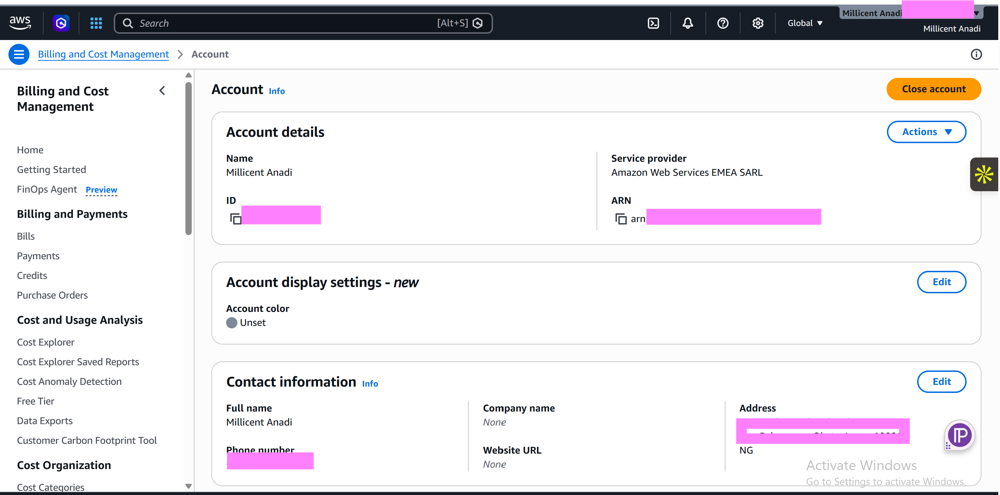

# Assignment 1 — AWS Free Tier Account Setup (EpicReads Cloud Onboarding)

Part of the DevOps Micro Internship (DMI) Cohort 3 with Agentic AI

---

## Purpose

In this assignment, you will create and verify an AWS Free Tier account as part of onboarding EpicReads — an online bookstore moving to the cloud. You will demonstrate an understanding of AWS fundamentals, Free Tier services, and account setup by answering conceptual questions and capturing proof of a working AWS Console login.

---

# Task 1 — Understanding AWS & Free Tier

## Goal

Demonstrate understanding of AWS basics and Free Tier usage by answering the following questions in your own words (3–4 lines each).

### Answers

#### Question 1 — What is an AWS account, and why do you need it at this stage?

An AWS account is a personal or organization's identity for accessing Amazon Web Services that allow you to create, manage, and use cloud resources such as virtual servers, storage, and databases. At this stage, an AWS account is needed so I can access the AWS Management Console, practice using cloud services, and complete hands-on DevOps tasks in a real cloud environment using the AWS Free Tier.

---

#### Question 2 — What is AWS Free Tier, and how long does it last?

The AWS Free Tier is a program that lets new users explore and use selected AWS services at no cost within certain monthly usage limits. It is designed for learning, testing, and building small applications. Most Free Tier offers for new accounts last 12 months from the date the account is created, although some services have always-free or short-term free usage options.

---

#### Question 3 — Name three AWS Free Tier services and their free usage limits.

1. Amazon EC2 – Provides virtual servers in the cloud. The AWS Free Tier includes 750 hours per month of a t2.micro or t3.micro instance (depending on the region) for 12 months.
2. Amazon S3 – Provides cloud storage for files and data. The Free Tier includes 5 GB of Standard Storage, along with limited requests and data transfer, for 12 months.
3. Amazon RDS – Provides managed relational databases. The Free Tier includes 750 hours per month of a single-db instance (such as db.t3.micro in eligible regions), plus 20 GB of database storage and 20 GB of backup storage for 12 months.

---

# Task 2 — Create AWS Free Tier Account

## Goal

Create a valid AWS Free Tier account and sign in to the AWS Management Console.

> No screenshots required for this task. Completion is verified through Task 3.

---

# Task 3 — Verify AWS Account

## Goal

Confirm that your AWS account setup is complete by navigating to the Account section and capturing proof.

### Evidence

#### Screenshot 1 — AWS Account page showing account name (email may be blurred)

---

# Submission Instructions

- Add all required screenshots in your GitHub repository submission
- Full name must be visible in required screenshots
- Do not expose sensitive information (keys, passwords, account IDs)

---

# Completion Checklist

- [x] Task 1 answers written in own words
- [x] AWS Free Tier account created successfully
- [x] Signed in to AWS Management Console
- [x] Screenshot of AWS Account page captured (full name visible, no sensitive data)
- [x] All required screenshots added to repository

---

## 📌 About DMI & CloudAdvisory

DevOps Micro Internship (DMI) is a project-based DevOps program run by Pravin Mishra (The CloudAdvisory) focused on real-world execution, systems thinking, and career readiness.

It helps learners build strong DevOps foundations with hands-on experience.

---

## 📌 Resources

- 🌐 DMI Official Website: https://pravinmishra.com/dmi  
- 🎓 DevOps for Beginners (Udemy): https://www.udemy.com/course/devops-for-beginners-docker-k8s-cloud-cicd-4-projects/  
- 🎓 Agentic AI DevOps with Claude Code: https://www.udemy.com/course/ultimate-agentic-ai-devops-with-claude-code/  
- 🎓 DevOps with Claude Code: Terraform, EKS, ArgoCD & Helm: https://www.udemy.com/course/devops-with-claude-code-terraform-eks-argocd-helm/  
- ▶️ YouTube Playlist: https://www.youtube.com/playlist?list=PLFeSNDtI4Cho  
- 🔗 Pravin Mishra (LinkedIn): https://www.linkedin.com/in/pravin-mishra-aws-trainer/  
- 🏢 CloudAdvisory (LinkedIn): https://www.linkedin.com/company/thecloudadvisory/

---

*This submission is part of DevOps Micro Internship (DMI) Cohort 3 — Agentic AI Track.*