# Assignment 5 — Bash Script Automation Drill (OPS Checklist)

Part of the DevOps Micro Internship (DMI) Cohort 3 with Agentic AI

---

## Purpose

In this assignment, you will practice Bash scripting by building a series of small automation scripts covering environment setup, variables, arrays, loops, file conditionals, if-else logic, and functions. These scripts form the foundation of real-world Linux automation used in DevOps, cloud, and production support environments.

---

# Task 1 — Bash Environment & Workspace Setup

## Goal

Verify that Bash is available on your system and create a clean workspace for this assignment.

### Evidence

#### Screenshot 1 — Output of `echo $SHELL` and `bash --version`

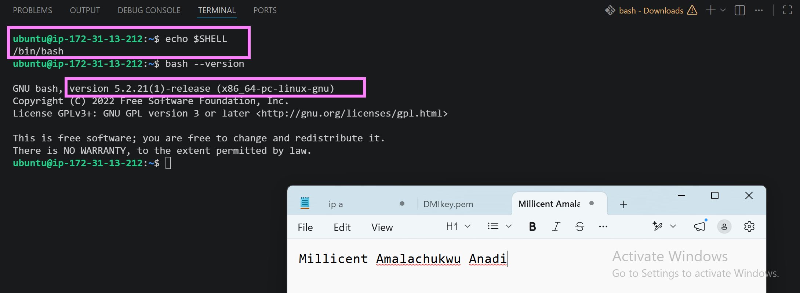

---

#### Screenshot 2 — Output of `pwd` and `ls -lah` showing the scripts directory

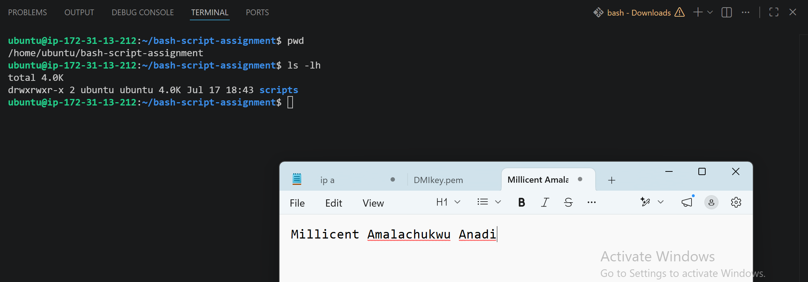

---

### Notes

Answer the following in your own words:

**1. What is Bash?**

Bash (Bourne Again SHell) is a command-line shell and scripting language commonly used on Linux and Unix-based operating systems. It allows users to interact with the operating system by executing commands, automating repetitive tasks through scripts, managing files and directories, and administering system resources. Bash is widely used by DevOps engineers and system administrators to automate workflows, manage servers, and perform operational tasks efficiently.

---

**2. What is the difference between shell and Bash?**

A shell is a general program that provides a command-line interface for interacting with an operating system. It accepts user commands and communicates with the operating system to execute them. There are several types of shells, such as Bash, Zsh, Fish, and KornShell.

Bash (Bourne Again SHell) is one specific type of shell. It is the default shell on many Linux systems and includes features for command execution, scripting, automation, and system administration.

In simple terms: A shell is the category, while Bash is one of the most widely used shells within that category.

---

**3. Why is it important to confirm the Bash version before writing scripts?**

It is important to confirm the Bash version before writing scripts because different versions of Bash support different features and syntax. A script that works on a newer version may fail on an older one if it uses unsupported commands or functionality. Verifying the Bash version helps ensure compatibility, reduces the risk of errors, and makes scripts more reliable across different Linux systems.

---

# Task 2 — Your First Bash Script

## Goal

Create your first Bash script, make it executable, and run it from the terminal.

### Evidence

#### Screenshot 1 — Content of `first-script.sh`

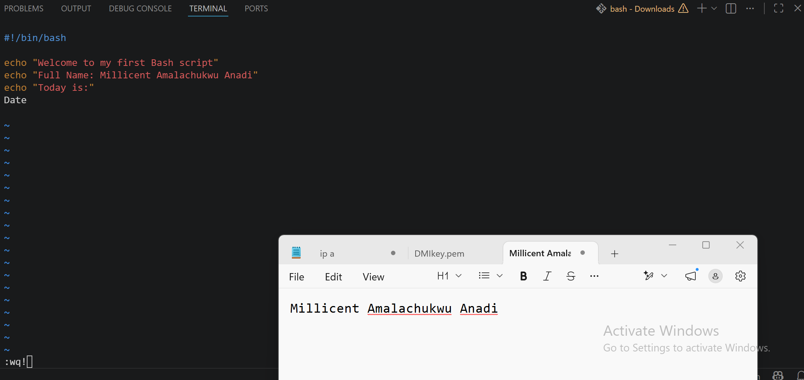

---

#### Screenshot 2 — Output of `./first-script.sh`

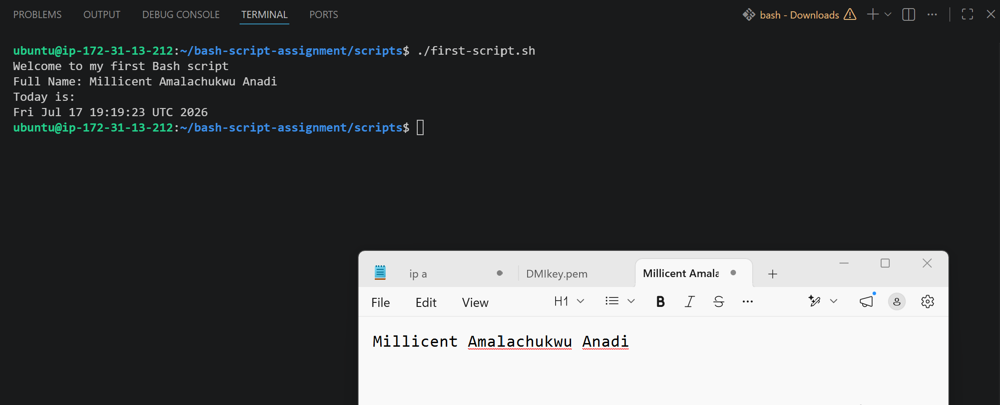

---

#### Screenshot 3 — Output of `ls -l first-script.sh` showing executable permission

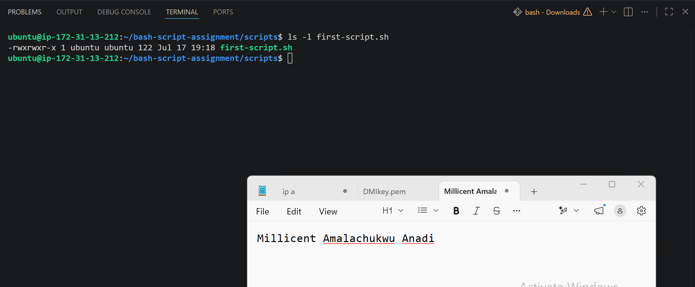

---

### Notes

Answer the following in your own words:

**1. What is the purpose of `#!/bin/bash`?**

The '#!/bin/bash line', known as the shebang, tells the operating system which interpreter should execute the script. When a script starts with #!/bin/bash, it instructs the system to run the script using the Bash shell. This ensures the script executes with the correct interpreter, improving compatibility and preventing errors that could occur if a different shell is used.

---

**2. Why do we use `chmod +x` before running a script?**

We use 'chmod +x' to give a script execute permission, allowing it to be run as a program. Without this permission, the operating system will not execute the script directly, even if it contains valid Bash commands. After making the script executable with 'chmod +x', it can be run using './script_name.sh.'

---

**3. What is the difference between running a script using `./script.sh` and `bash script.sh`?**

Running a script with ./script.sh executes the script directly as a program. For this to work, the script must have execute permission (using 'chmod +x') and should include a shebang line such as '#!/bin/bash' to specify the interpreter.

Running a script with 'bash script.sh' explicitly tells Bash to execute the script. This method does not require the script to have execute permission, because the Bash interpreter is invoked directly. Both methods run the script, but './script.sh' relies on execute permissions and the shebang, while 'bash script.sh' runs the script using Bash regardless of its executable status.

---

# Task 3 — Variables: User Information Script

## Goal

Use variables to store and display user-related information.

### Evidence

#### Screenshot 1 — Content of `user-info.sh`

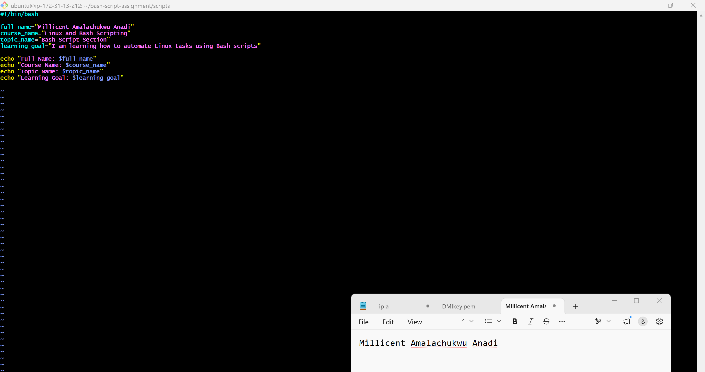

---

#### Screenshot 2 — Output of `./user-info.sh`

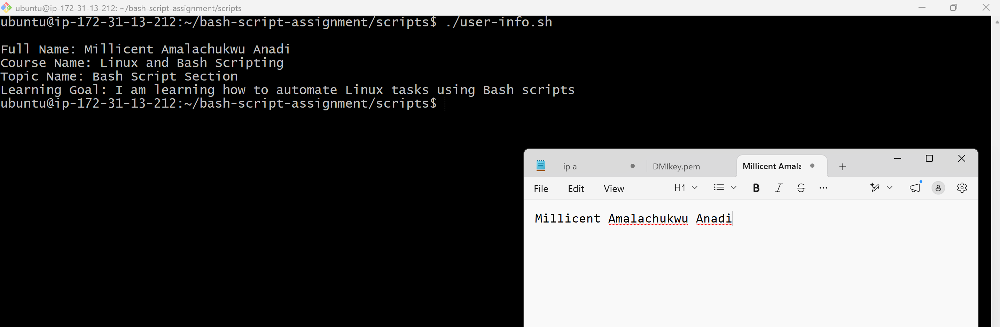

---

### Notes

Answer the following in your own words:

**1. What is a variable in Bash?**

A variable in Bash is a named container used to store data, such as text, numbers, or command output. Variables make scripts more flexible by allowing values to be reused, updated, and referenced throughout the script without repeating the same information.

---

**2. Why should we avoid spaces around the `=` sign when creating variables?**

Spaces should be avoided around the '=' sign when creating variables because Bash treats spaces as separators between commands and arguments. If spaces are added, Bash will not recognize the variable assignment correctly and will produce an error. For example, 'name=John' is correct, while name '= John' is invalid.
---

**3. How do you access the value stored inside a Bash variable?**

To access the value stored in a Bash variable, prefix the variable name with a dollar sign ('$'). For example, if a variable is defined as 'name="Millicent"', you can display its value using 'echo $name', which outputs Millicent.
---

# Task 4 — Arrays & Loops: Tools Checklist Script

## Goal

Use arrays and loops to print a checklist of tools used in Bash scripting.

### Evidence

#### Screenshot 1 — Content of `tools-checklist.sh`

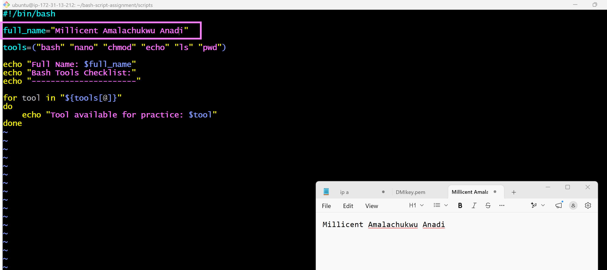
---

#### Screenshot 2 — Output of `./tools-checklist.sh`

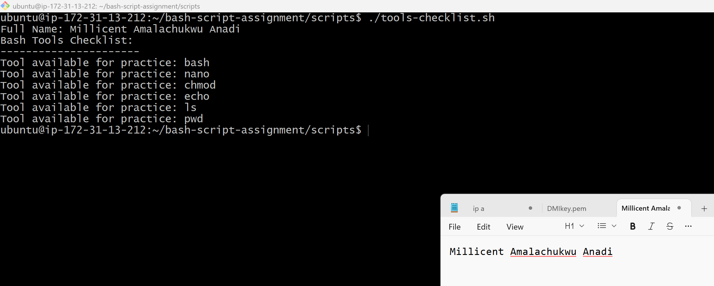
---

### Notes

Answer the following in your own words:

**1. What is an array in Bash?**

An array in Bash is a variable that can store multiple values under a single name. Each value is stored at a specific index, starting from 0, allowing you to organize and access related data efficiently. Arrays are useful for managing lists of items, looping through values, and simplifying scripts that work with multiple pieces of data.

---

**2. Why are arrays useful in scripts?**

Arrays are useful in Bash scripts because they allow you to store and manage multiple related values in a single variable. This makes scripts more organized, reduces repetition, and makes it easier to loop through lists of items, process data, and automate repetitive tasks efficiently.

---

**3. What does `"${tools[@]}"` mean?**

'${tools[@]}' represents all the elements in the tools array. When used in a loop or command, it expands to each item in the array individually, allowing you to process or display every value stored in the array.

---

**4. What is the purpose of the `for` loop in this script?**

The 'for' loop is used to iterate through each element in the array and execute the same set of commands for every item. It automates repetitive tasks by processing each value one at a time, making the script more efficient and easier to maintain.

---

# Task 5 — Loops: Number Counter Script

## Goal

Use loops to repeat a task multiple times.

### Evidence

#### Screenshot 1 — Content of `counter.sh`

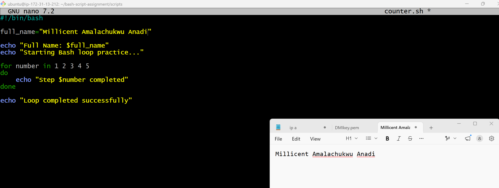
---

#### Screenshot 2 — Output of `./counter.sh`

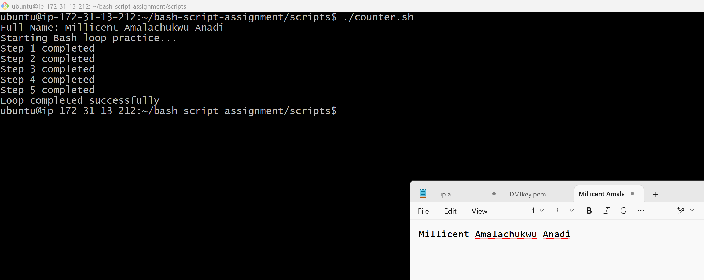
---

### Notes

Answer the following in your own words:

**1. What is a loop?**

A loop is a programming construct that repeatedly executes a block of code until a specified condition is met or for a set number of times. In Bash, loops are commonly used to automate repetitive tasks, process lists of items, and make scripts more efficient.

---

**2. Why do we use loops in Bash scripting?**

Loops are used in Bash scripting to automate repetitive tasks by executing the same set of commands multiple times. They reduce code duplication, make scripts more efficient, and simplify processing lists of items, files, or numbers.

---

**3. How many times did the loop run in your script?**

The loop ran 5 times because it iterated through the values 1, 2, 3, 4, and 5. During each iteration, it printed a message indicating that the current step had been completed.

---

**4. What would you change if you wanted the loop to run 10 times?**

To make the loop run 10 times, I would update the list of numbers to include 1 through 10. For example: 'for number in 1 2 3 4 5 6 7 8 9 10'  This change makes the loop execute 10 times, printing the message once for each number.

---

# Task 6 — Files & Conditionals: File Validation Script

## Goal

Use file checks and conditionals to verify whether files and directories exist.

### Evidence

#### Screenshot 1 — Output of `ls -lah ../test-folder`

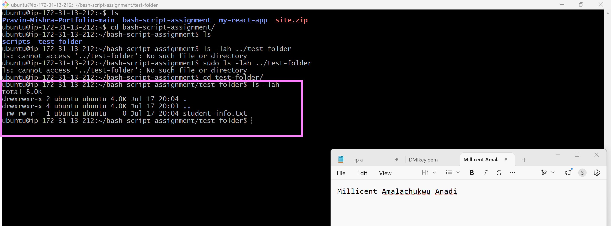

---

#### Screenshot 2 — Content of `file-check.sh`

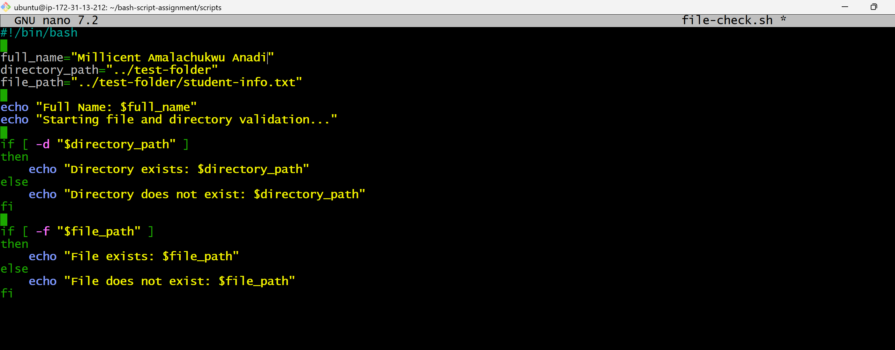

---

#### Screenshot 3 — Output of `./file-check.sh`

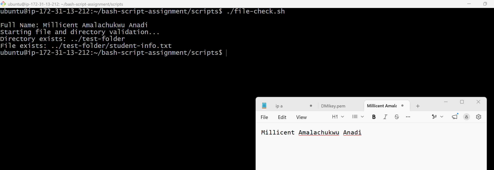

---

### Notes

Answer the following in your own words:

**1. What does `-d` check in Bash?**

In Bash, the '-d' checks whether a path exists and is a directory.

---

**2. What does `-f` check in Bash?**

'-f' checks whether a specified path exists and is a regular file (not a directory).

---

**3. Why should file and directory paths be stored in variables?**

File and directory paths should be stored in variables because it makes scripts easier to read, update, and reuse. If the path changes, you only need to update the variable instead of changing it in multiple places.

---

**4. What happens if the file does not exist?**

If the file does not exist, the '-f' test returns false, and the commands inside the else block (if provided) are executed. This helps prevent errors by allowing the script to handle missing files appropriately.

---

# Task 7 — Conditionals: Pass or Retry Script

## Goal

Use if-else conditionals to make decisions based on a variable value.

### Evidence

#### Screenshot 1 — Content of `score-check.sh` with `score=85`

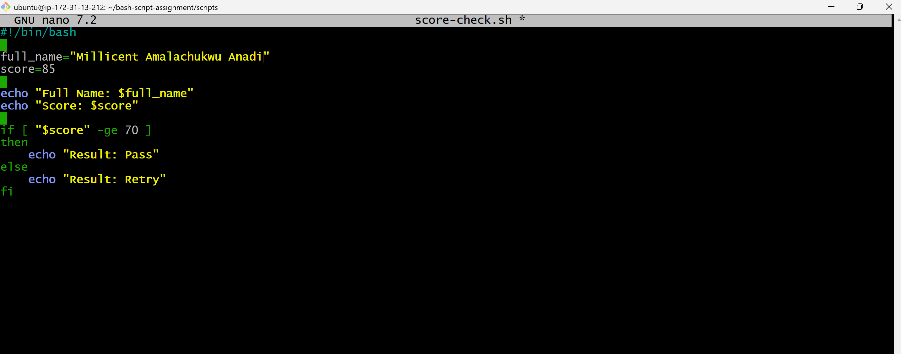

---

#### Screenshot 2 — Output showing `Result: Pass`

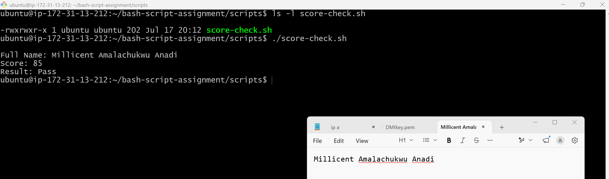

---

#### Screenshot 3 — Content of `score-check.sh` with `score=55`

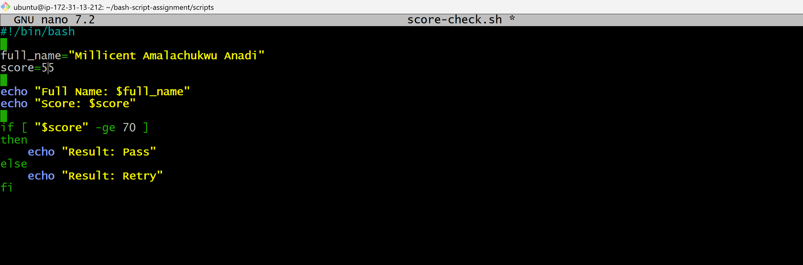

---

#### Screenshot 4 — Output showing `Result: Retry`

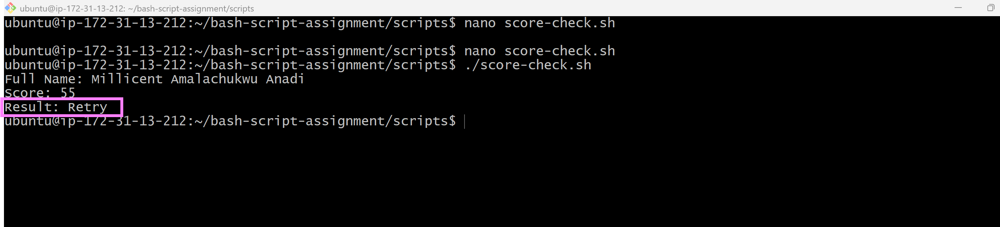

---

### Notes

Answer the following in your own words:

**1. What is the purpose of if-else in Bash?**

The purpose of an 'if-else' statement in Bash is to make decisions based on a condition. It allows the script to run one set of commands if the condition is true, and a different set of commands if the condition is false.

---

**2. What does `-ge` mean?**

'-ge' means "greater than or equal to." It is used to compare two integer values in Bash and returns true if the first number is greater than or equal to the second number.

---

**3. Why should conditions be tested with different values?**

Conditions should be tested with different values to make sure the script works correctly in all situations. This helps verify that both the 'if' and 'else' branches behave as expected and helps identify any errors or unexpected behavior.

---

**4. How can conditionals help in automation scripts?**

Conditionals help in automation scripts by allowing the script to make decisions based on different conditions. This enables the script to perform different actions automatically, such as checking if a file exists, verifying user input, or handling errors without requiring manual intervention.

---

# Task 8 — Functions: Final Bash Automation Script

## Goal

Create a final Bash script using functions to organize reusable code.

### Evidence

#### Screenshot 1 — Content of `final-automation.sh`

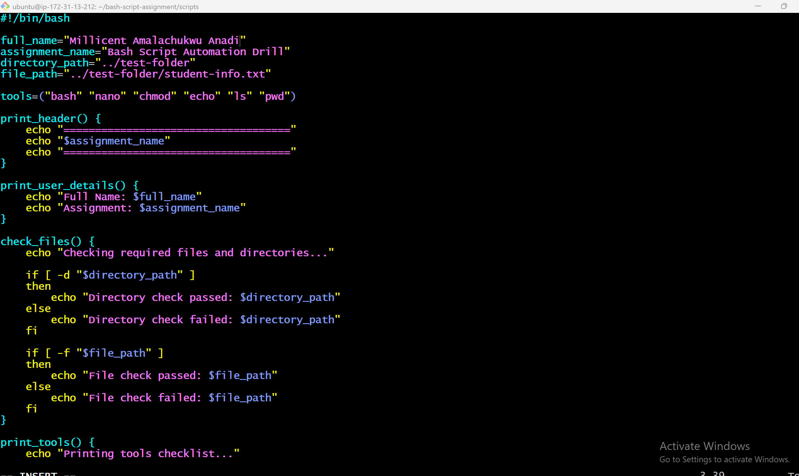

---

#### Screenshot 2 — Output of `./final-automation.sh`

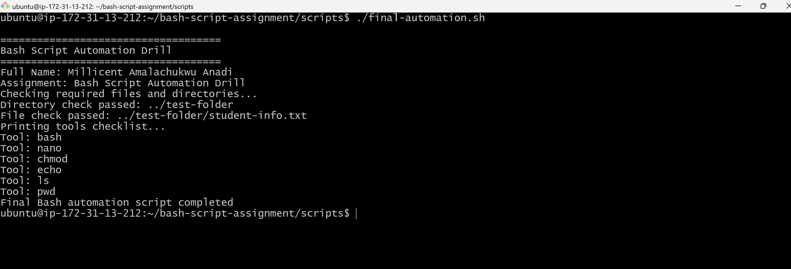

---

#### Screenshot 3 — Output of `ls -lah` showing all created scripts

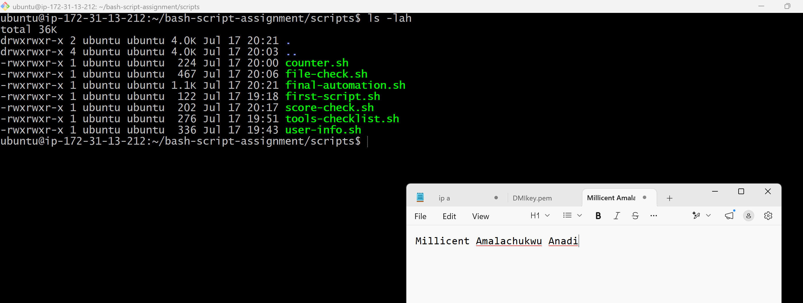

---

### Notes

Answer the following in your own words:

**1. What is a function in Bash?**

A function in Bash is a reusable block of code that performs a specific task. It helps organize scripts, reduces repetition, and makes the code easier to read and maintain.

---

**2. Why are functions useful in scripts?**

Functions are useful in scripts because they let you reuse the same code multiple times without rewriting it. This makes scripts shorter, easier to read, easier to maintain, and simpler to update or debug.

---

**3. Which functions did you create in this script?**

I created four functions in my script: 'print_header()', 'print_user_details()', 'check_files()', and 'print_tools()'. Each function performs a specific task, making the script more organized and easier to maintain.

---

**4. How does this final script combine variables, arrays, loops, conditionals, files, and functions?**

The final script combines variables to store information, arrays to keep a list of tools, loops to go through each tool, conditionals to check whether files and directories exist, file handling to work with files, and functions to organize the code into reusable sections. Together, these features make the script more structured, efficient, and easier to maintain.

---

# LinkedIn Post (Required)

## Evidence

#### LinkedIn Post URL

Paste your LinkedIn post URL here:

https://www.linkedin.com/posts/millicent-anadi-b7b93a175_linux-bash-shellscripting-ugcPost-7486349085327785984-_rbj/?utm_source=share&utm_medium=member_desktop&rcm=ACoAACmbeQ8Bk7IWiCzNrTecawWZMBxbCmmmG5E

---

#### Screenshot — Published LinkedIn post

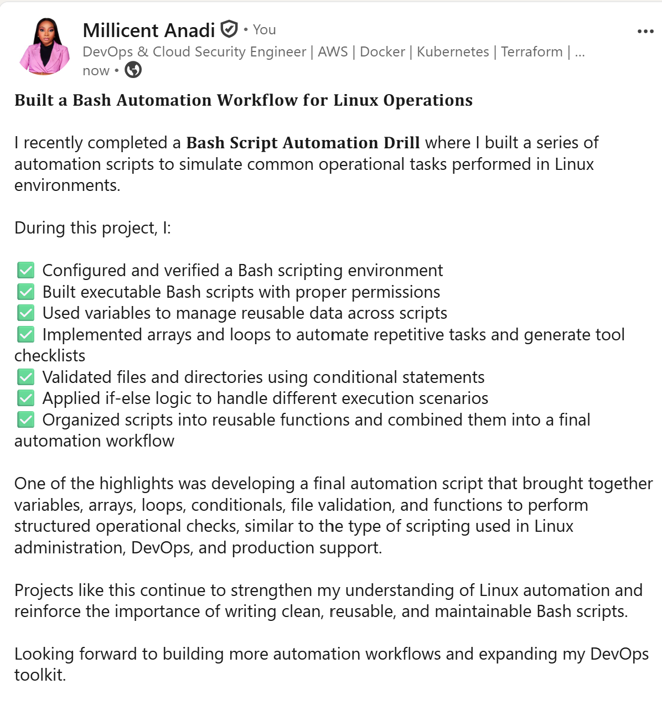

---

# Submission Instructions

- Add all required screenshots in your submission
- Full name must be visible in required screenshots
- All script files must be created and run successfully
- Required notes must be answered clearly for every task
- Do not expose sensitive information (keys, passwords, credentials)

---

# Completion Checklist

- [x] Task 1: Environment setup verified, workspace created (Screenshots 1–2, Notes answered)
- [x] Task 2: First script created, executed, permissions verified (Screenshots 1–3, Notes answered)
- [x] Task 3: Variables script created and run (Screenshots 1–2, Notes answered)
- [x] Task 4: Arrays and loops script created and run (Screenshots 1–2, Notes answered)
- [x] Task 5: Counter loop script created and run (Screenshots 1–2, Notes answered)
- [x] Task 6: File validation script created and run (Screenshots 1–3, Notes answered)
- [x] Task 7: Pass/Retry conditional script tested with both values (Screenshots 1–4, Notes answered)
- [x] Task 8: Final automation script created and run (Screenshots 1–3, Notes answered)
- [x] All scripts run without errors
- [x] Full Name visible in all required screenshots
- [x] LinkedIn post published and URL submitted
- [x] No sensitive data exposed

---

## 📌 About DMI & CloudAdvisory

DevOps Micro Internship (DMI) is a project-based DevOps program run by Pravin Mishra (The CloudAdvisory) focused on real-world execution, systems thinking, and career readiness.

It helps learners build strong DevOps foundations with hands-on experience.

---

## 📌 Resources

- 🌐 DMI Official Website: https://pravinmishra.com/dmi  
- 🎓 DevOps for Beginners (Udemy): https://www.udemy.com/course/devops-for-beginners-docker-k8s-cloud-cicd-4-projects/  
- 🎓 Agentic AI DevOps with Claude Code: https://www.udemy.com/course/ultimate-agentic-ai-devops-with-claude-code/  
- 🎓 DevOps with Claude Code: Terraform, EKS, ArgoCD & Helm: https://www.udemy.com/course/devops-with-claude-code-terraform-eks-argocd-helm/  
- ▶️ YouTube Playlist: https://www.youtube.com/playlist?list=PLFeSNDtI4Cho  
- 🔗 Pravin Mishra (LinkedIn): https://www.linkedin.com/in/pravin-mishra-aws-trainer/  
- 🏢 CloudAdvisory (LinkedIn): https://www.linkedin.com/company/thecloudadvisory/

---

*This submission is part of DevOps Micro Internship (DMI) Cohort 3 — Agentic AI Track.*