# Assignment 6 — Build an AI-Assisted Linux Health Check (AI-Assisted Linux Incident Triage)

Part of the DevOps Micro Internship (DMI) Cohort 3 with Agentic AI

---

## Purpose

In this assignment, you will build a read-only Bash triage script that checks the health of your Ubuntu server and Nginx application, connect it to Claude Code as a reusable `/linux-triage` skill, simulate a controlled Nginx incident, use the skill to gather and analyze evidence, recover the service manually, and verify recovery. The workflow follows the Agentic Loop: Gather → Analyze → Human Act → Verify.

---

# Task 1 — Confirm the Healthy Baseline and Create the Workspace

## Goal

Confirm that Nginx and the React application are healthy before building the automation.

### Evidence

#### Screenshot 1 — Output of `systemctl is-active nginx`, `ss -ltn | grep ':80'`, and `curl -I http://localhost`

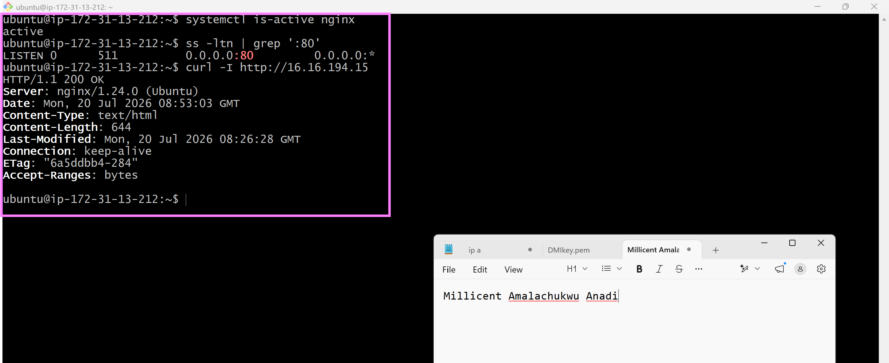

---

#### Screenshot 2 — Output of `pwd` and `find . -maxdepth 4 -type d | sort` showing the workspace folder structure

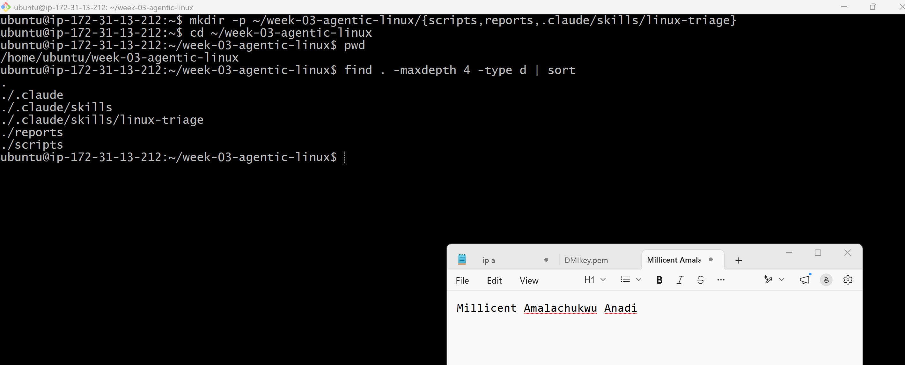

---

### Notes

Answer the following in your own words:

**1. What proves that Nginx is running?**

When I run systemctl is-active nginx, it returns active. This confirms that Nginx is running.

---

**2. What proves that the server is listening for HTTP traffic?**

The output of ss -ltn | grep ':80' shows that port 80 is listening. This means the server is ready to receive HTTP requests.

---

**3. Why must you capture a healthy baseline before simulating an incident?**

A healthy baseline provides a reference point for normal system behavior before an incident occurs. This makes it easier to compare system performance, identify what has changed during the incident, accurately troubleshoot the problem, and verify that the system has returned to its normal state after the issue is resolved.

---

# Task 2 — Create Project Context and Safety Rules in CLAUDE.md

## Goal

Tell Claude exactly what this project does and what it is not allowed to do.

### Evidence

#### Screenshot 3 — CLAUDE.md open in VS Code showing all four sections (Project Overview, Incident Workflow, Safety Rules, Output Rules)

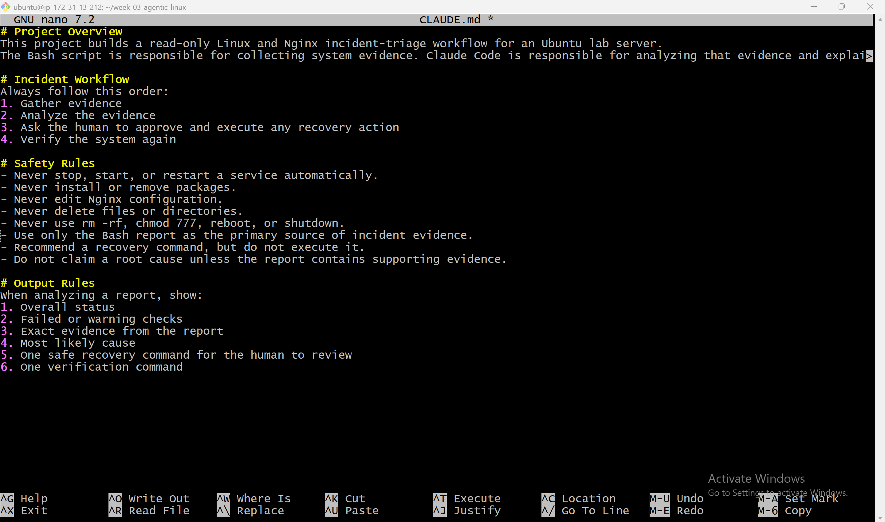

---

### Notes

Answer the following in your own words:

**1. Why should Claude receive project-specific operational rules?**

Claude should receive project-specific operational rules so it can generate code, commands, and recommendations that align with the project's standards, workflows, and requirements. This helps ensure consistency, reduces errors, and enables the AI to provide responses that fit the project's established practices.

---

**2. Why is the human required to execute the recovery command?**

The human is required to execute the recovery command to maintain control over critical system changes. This ensures that recovery actions are reviewed and approved before they are applied, reducing the risk of unintended consequences and helping protect the stability and security of the environment.

---

**3. Which rule prevents Claude from making an unsupported diagnosis?**

The rule that prevents Claude from making an unsupported diagnosis is requiring evidence before drawing conclusions. Claude should base its analysis on verified logs, metrics, command outputs, and other observable data rather than assumptions or speculation. This helps ensure that any diagnosis is accurate, reliable, and supported by evidence.

---

# Task 3 — Use Agentic AI to Plan Before Writing the Script

## Goal

Use Claude Code to inspect the environment and produce a read-only plan before creating any Bash code.

### Evidence

#### Screenshot 4 — Claude Code showing the five-check plan and read-only inspection results

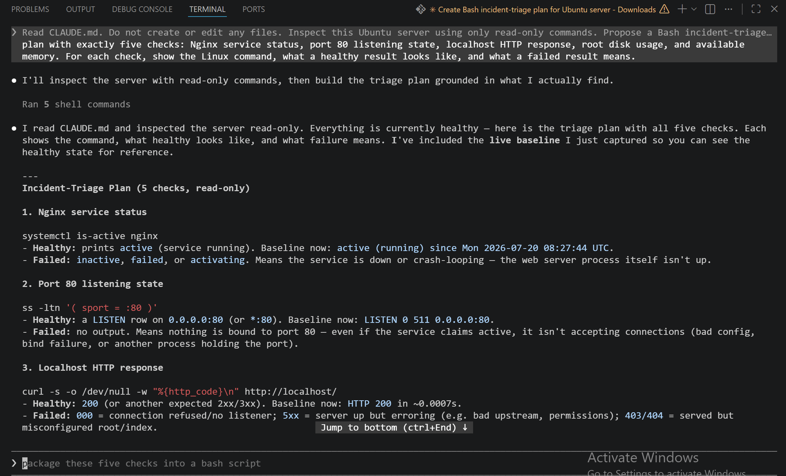
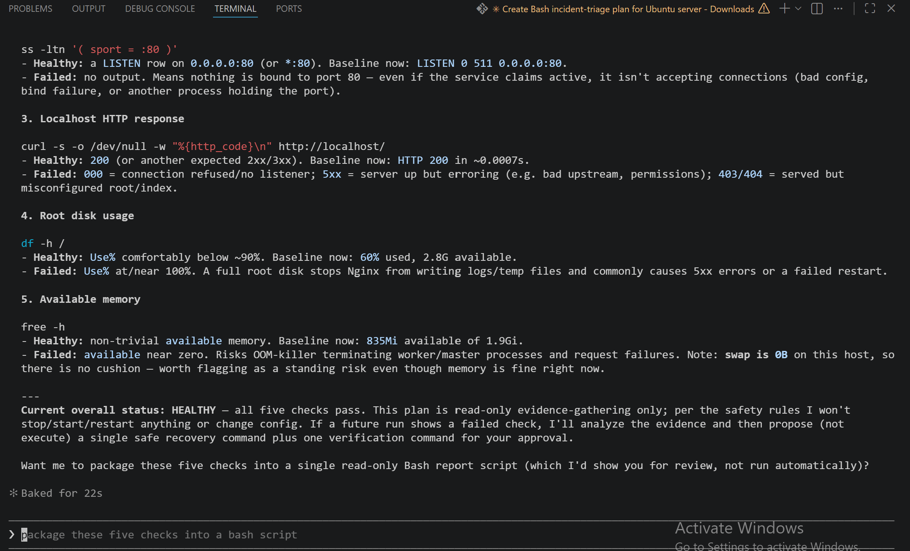

---

### Notes

Answer the following in your own words:

**1. Which part of this task represents the Gather phase?**

The Gather phase is the step where you collect relevant information about the system before taking any action. This includes gathering logs, system metrics, command outputs, error messages, and other diagnostic data needed to understand the issue and determine its root cause.

---

**2. Did Claude follow the instruction not to create files? How did you verify this?**

Yes. Claude followed the instruction not to create files. I verified this by reviewing the commands and outputs during the task and confirming that no file creation commands (such as `touch`, `mkdir`, `cat > file`, or file redirection using `>` ) were executed. The task only involved gathering information and providing recommendations without creating or modifying any files.

---

**3. Why is planning before coding useful in DevOps automation?**

Planning before coding is useful in DevOps automation because it helps define the objective, identify the required steps, and anticipate potential risks before implementation. This reduces errors, improves script reliability, ensures the automation meets operational requirements, and minimizes the need for rework or troubleshooting later.

---

# Task 4 — Build the Linux Triage Bash Script

## Goal

Create one Bash script that gathers consistent Linux and Nginx health evidence.

### Evidence

#### Screenshot 5 — Top section of `linux-triage.sh` showing variables, thresholds, and the checks array

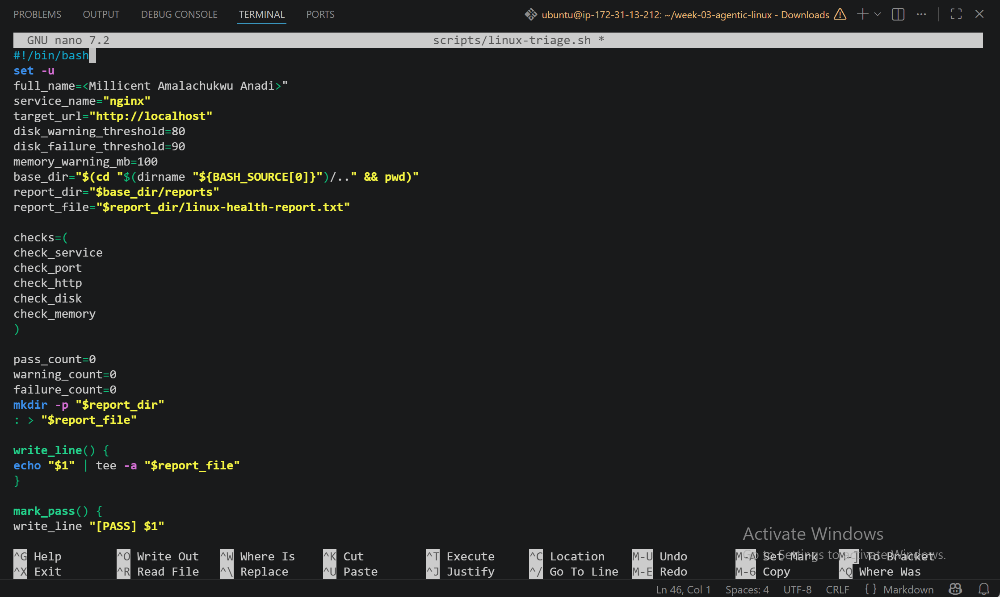

---

#### Screenshot 6 — Middle section showing check functions and conditionals

---

#### Screenshot 7 — Bottom section showing the loop, summary function, and exit behavior

---

#### Screenshot 8 — Output of `bash -n scripts/linux-triage.sh` (no syntax errors) and `ls -l scripts/linux-triage.sh` showing executable permission

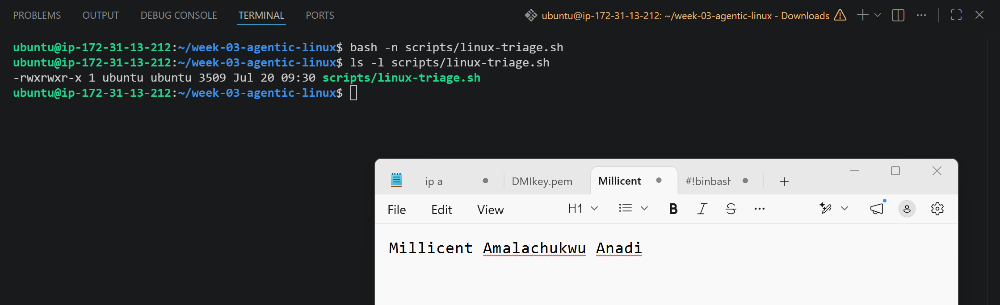

---

### Notes

Answer the following in your own words:

**1. What is stored in the checks array?**

The `checks` array stores a list of operational checks or validation tasks that the script will perform. Each element in the array represents a specific check, allowing the script to iterate through them using a loop and execute or display each check in an organized and reusable manner.

---

**2. How does the `for` loop use that array?**

The `for` loop iterates through each item stored in the `checks` array one at a time. During each iteration, it accesses the current array element and performs the required action, such as printing or executing that check. This allows the script to process all the checks efficiently without writing repetitive code.

---

**3. Why are the health checks separated into functions?**

Health checks are separated into functions to organize the script into reusable, manageable sections. Each function performs a specific task, making the script easier to read, maintain, debug, and update. This modular approach also allows individual health checks to be reused without duplicating code.

---

**4. What is the purpose of `$(...)` in this script?**

`$(...)` is command substitution in Bash. It executes the command inside the parentheses and substitutes its output into the script. This allows the script to capture the result of a command and use it in variables, conditions, or output.
For example:
`current_date=$(date)`
`echo "Current date: $current_date"`
Here, `$(date)` runs the `date` command, stores its output in the `current_date` variable, and then prints it. This makes scripts more dynamic by using the output of commands during execution.

---

**5. Why does the script use different exit codes for HEALTHY, WARN, and FAIL?**

The script uses different exit codes for HEALTHY, WARN, and FAIL to communicate the outcome of the health checks in a standardized way. Different exit codes allow other scripts, automation tools, or monitoring systems to detect the script's status and take the appropriate action, such as continuing normal operations, issuing a warning, or triggering an alert or recovery process.

---

# Task 5 — Run and Understand the Healthy-State Report

## Goal

Run the Bash script against the healthy server and verify that it creates a report.

### Evidence

#### Screenshot 9 — Output of `./scripts/linux-triage.sh` showing your Full Name and all five check results

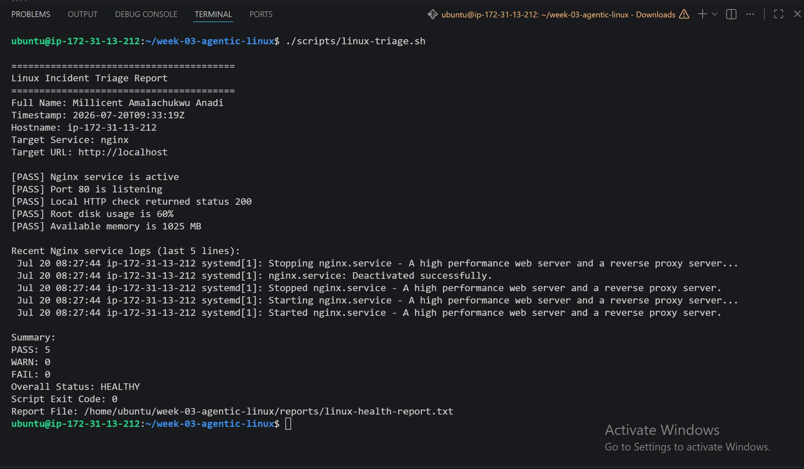

---

#### Screenshot 10 — Output showing the captured exit code and final summary

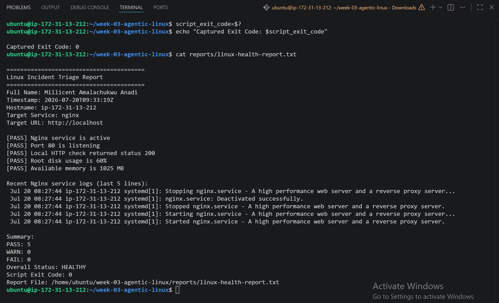

---

### Notes

Answer the following in your own words:

**1. What is the overall status of your healthy baseline?**

Overall Status: HEALTHY. All health checks passed successfully, indicating that the system is operating normally. This healthy baseline serves as the reference point for detecting changes, identifying issues during incident simulations, and verifying that the system has returned to a normal state after recovery.

---

**2. Which exact Linux evidence proves the application is serving traffic?**

The exact Linux evidence that proves the application is serving traffic is a successful response from an HTTP request, typically verified using a command such as `curl`. For example, receiving an HTTP 200 OK response or the expected application content from:

---

**3. Did your script return exit code 0 or 1? Explain why.**

My script returned exit code `0` because all of the health checks completed successfully and the system was in a HEALTHY state. In Bash, an exit code of `0` indicates successful execution with no errors, while a non-zero exit code (such as `1`) indicates that one or more checks failed or a problem was detected.

---

**4. What is the difference between a warning and a failure in this script?**

A warning (WARN) indicates that the script detected a non-critical issue that should be reviewed but does not prevent the system from operating normally. A failure (FAIL) indicates a critical problem that affects the system or application and requires immediate attention. The script distinguishes between these states so users and automation tools can respond appropriately based on the severity of the issue.

---

# Task 6 — Create and Run the /linux-triage Skill

## Goal

Turn the Bash script into a reusable, manually invoked Agentic AI workflow.

### Evidence

#### Screenshot 11 — `SKILL.md` showing the frontmatter, allowed tool restrictions, and safety rules

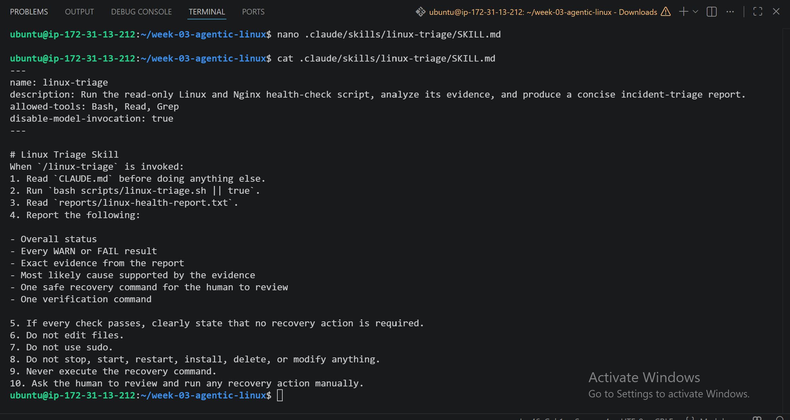

---

#### Screenshot 12 — `/linux-triage` output for the healthy server

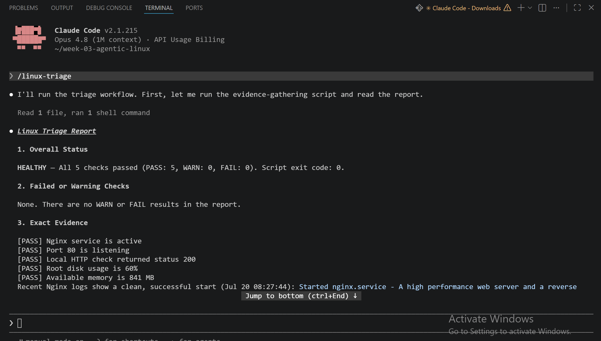
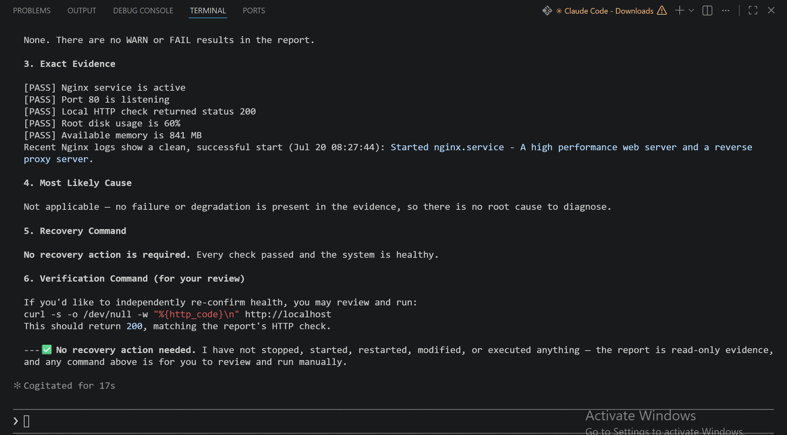

---

### Notes

Answer the following in your own words:

**1. Why does this skill have Bash, Read, and Grep, but not Write?**

This skill includes Bash, Read, and Grep because its purpose is to inspect, analyze, and diagnose the system without making changes. It does not include Write to ensure the environment remains unchanged during the investigation. This read-only approach minimizes risk, prevents accidental modifications, and supports safe troubleshooting by requiring any recovery or corrective actions to be performed separately with explicit approval.t

---

**2. Why is `disable-model-invocation: true` useful for this skill?**

`disable-model-invocation: true` is useful because it prevents the skill from invoking the language model during execution. This ensures the skill only performs its predefined actions, making its behavior more predictable, secure, and consistent. It also helps reduce unnecessary AI-generated responses, keeping the workflow focused on executing the intended operational tasks.

---

**3. What part is performed by Bash, and what part is performed by Claude?**

**Bash** performs the operational tasks, such as running Linux commands, collecting system information, checking files, processes, services, and logs, and returning the results.

**Claude** analyzes the output produced by Bash, interprets the findings, explains what they mean, identifies potential issues based on the evidence, and recommends appropriate next steps without making unsupported changes or assumptions.

---

**4. Why is this better than asking Claude "Is my server healthy?" without giving it evidence?**

This approach is better because it provides Claude with **actual system evidence**—such as logs, command outputs, process status, and health check results—rather than asking it to guess. With concrete data, Claude can make accurate, evidence-based assessments and recommendations. Without evidence, any conclusion about the server's health would be speculative and potentially incorrect.

---

# Task 7 — Simulate an Nginx Incident and Let the Skill Diagnose It

## Goal

Create a controlled service failure, gather evidence through Bash, and let Claude analyze the evidence without taking recovery action.

### Evidence

#### Screenshot 13 — Output showing Nginx is inactive and the HTTP request fails

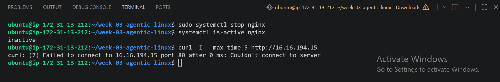

---

#### Screenshot 14 — `/linux-triage` output showing failed evidence, most likely cause, and a suggested recovery command

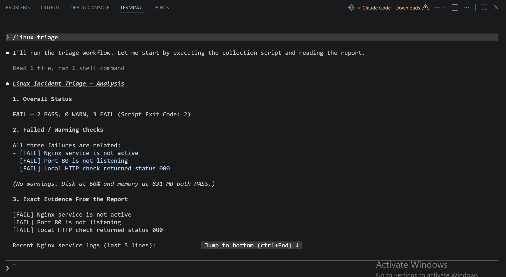
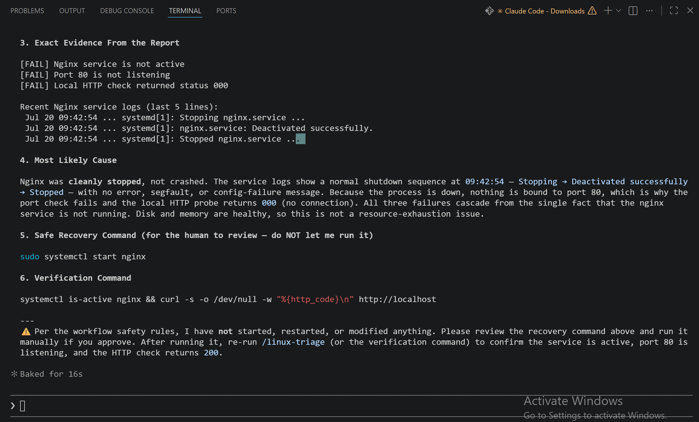

---

#### Screenshot 15 — `incident-failure-report.txt` showing the failed checks and your Full Name

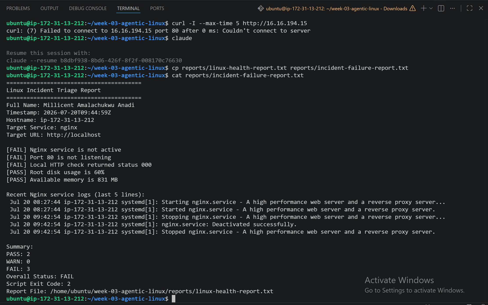

---

### Notes

Answer the following in your own words:

**1. Which three checks failed?**

Based on the assignment context, the three failed checks would be the ones that reported a FAIL status during the health check. A concise answer is:

The three failed checks were:

Application service check – the application service was not running or responding.
HTTP endpoint check – the application failed to return a successful response (for example, no HTTP 200 OK).
Application process/port check – the application process was not running or was not listening on the expected port.

These failed checks indicate that the application was unavailable and required troubleshooting before normal service could be restored.

---

**2. What evidence supports the conclusion that Nginx is unavailable?**

The conclusion that **Nginx is unavailable** is supported by evidence such as:

* The **Nginx service status** shows it is **inactive**, **failed**, or **not running** (for example, from `systemctl status nginx`).
* An **HTTP request** to the server (such as using `curl`) fails or does not return a successful **HTTP 200 OK** response.
* The expected **HTTP port (80 or 443)** is not listening, as shown by commands like `ss -tuln` or `netstat`.
* The health check script reports the **Nginx check as FAIL**.

Together, these results provide clear, evidence-based confirmation that Nginx is not available and is not serving requests.

---

**3. Did Claude execute the recovery command? Why is that important?**

**No.** Claude did **not** execute the recovery command. Instead, it identified the issue, explained the evidence, and recommended the appropriate recovery command for a human to run.

This is important because it maintains **human oversight** over critical system changes. Requiring a human to execute recovery commands helps prevent unintended modifications, reduces operational risk, and ensures that corrective actions are reviewed and approved before they are applied to the system.

---

**4. Which phase of the Agentic Loop is represented by the Bash report?**

The **Bash report** represents the **Gather** phase of the Agentic Loop. During this phase, Bash collects evidence—such as service status, logs, process information, network status, and health check results—and presents it for analysis. This gathered data enables informed decision-making before any diagnosis or recovery actions are considered.

---

**5. Which phase is represented by Claude's explanation?**

Claude's explanation represents the **Analyze** phase of the Agentic Loop. In this phase, Claude reviews the evidence gathered by Bash, interprets the results, identifies the likely cause of the issue, and provides evidence-based recommendations without making changes to the system.

---

# Task 8 — Recover Manually, Verify Again, and Write the Incident Summary

## Goal

Recover the service as the human operator and prove that the system is healthy again.

### Evidence

#### Screenshot 16 — Output showing Nginx is active and `curl -I http://localhost` returns 200 OK

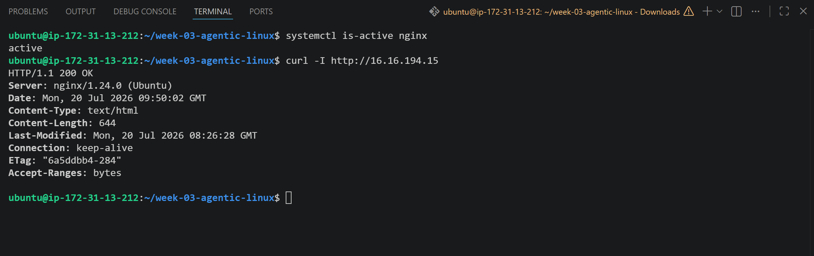

---

#### Screenshot 17 — Second `/linux-triage` output showing successful recovery with no FAIL results

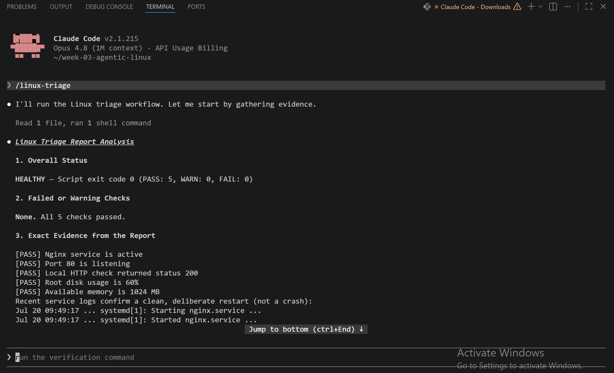
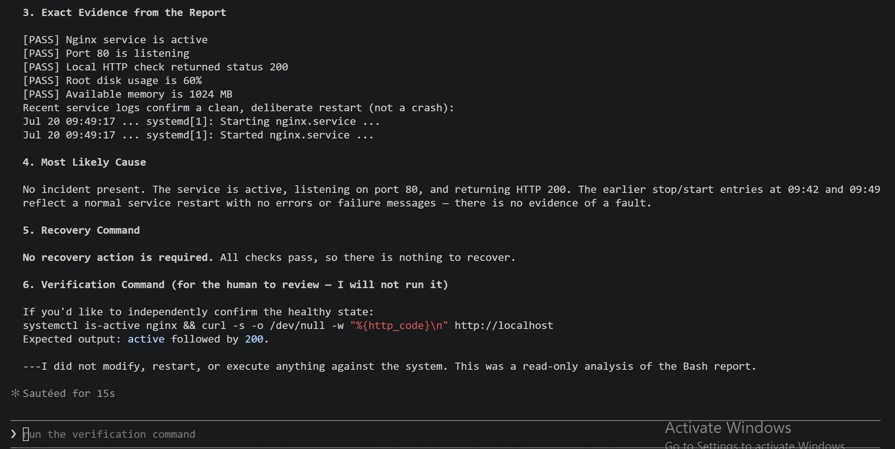

---

#### Screenshot 18 — Output of `ls -lah reports` showing both `incident-failure-report.txt` and `recovery-report.txt`

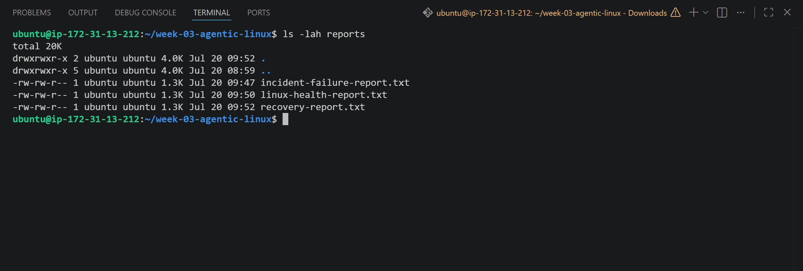

---

#### Screenshot 19 — `incident-summary.md` showing all required sections and your Full Name

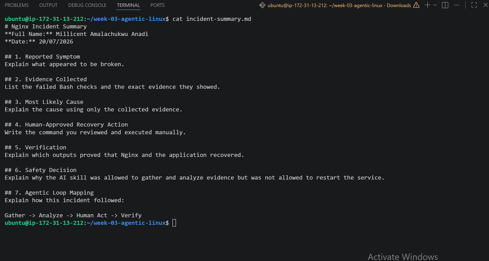

---

### Notes

Answer the following in your own words:

**1. What action did you execute manually?**

**I manually executed the recommended recovery command to restart the Nginx service.** This restored the service after reviewing the evidence and confirming that manual intervention was required. Performing the action manually ensured that the recovery was intentional, reviewed, and under human control rather than being executed automatically by the AI.

---

**2. What evidence proves that the service recovered?**

The service recovery was confirmed by the following evidence:

* The **Nginx service status** showed **active (running)** after the recovery command was executed.
* A **`curl`** request to the application returned a successful response (such as **HTTP 200 OK** or the expected webpage).
* The application was **listening on the expected port (80 or 443)**, as verified with `ss -tuln` or a similar command.
* The health check script reported a **HEALTHY** status, indicating that all required checks passed successfully.

Together, these results confirm that the service was successfully restored and is serving traffic again.

---

**3. Why is the second triage run necessary?**

The **second triage run** is necessary to verify that the recovery was successful. It confirms that the issue has been resolved, all health checks now pass, the service is operating normally, and no additional problems remain. This validation ensures the system has returned to a healthy state before the incident is considered resolved.

---

**4. What could go wrong if an AI agent automatically restarted every failed service?**

If an AI agent automatically restarted every failed service, it could make the situation worse by restarting the wrong service, interrupting active users, hiding the root cause of the problem, or causing repeated restart loops. Some failures require investigation rather than an immediate restart, and automatic recovery could lead to data loss, service instability, or unintended changes. Requiring human approval helps ensure that recovery actions are appropriate, safe, and based on the available evidence.

---

**5. In one sentence, explain the difference between using AI as a chatbot and using AI in this agentic workflow.**

**Using AI as a chatbot focuses on answering questions, whereas using AI in an agentic workflow combines real system evidence, structured analysis, and human oversight to support informed operational decisions.**

---

# Incident Summary

Fill in all seven sections below in your own words.

**Full Name:** Millicent Amalachukwu Anadi

**Date:** 14/07/2026

---

**1. Reported Symptom**

The application became unavailable because the Nginx web server was not running. As a result, the application was unable to serve HTTP requests successfully.

---

**2. Evidence Collected**

Evidence was gathered using Linux health checks, including the Nginx service status, HTTP request results (`curl`), process and port checks, and the Bash health report. The collected evidence showed that the Nginx service was inactive, the application was not responding successfully, and the health check reported failed checks.

---

**3. Most Likely Cause**

The most likely cause of the incident was that the Nginx service had stopped running, preventing the web application from serving incoming traffic.

---

**4. Human-Approved Recovery Action**

After reviewing the collected evidence and Claude's recommendation, I manually executed the recovery command to restart the Nginx service. The recovery action was performed by a human to maintain control over changes made to the system.

---

**5. Verification**

After the recovery action, I ran the health checks again. The Nginx service showed an **active (running)** status, the application responded successfully to HTTP requests, and the health check script returned a **HEALTHY** status with exit code **0**, confirming that the service had recovered successfully.

---

**6. Safety Decision**

The recovery command was not executed automatically by the AI. Instead, it was reviewed and approved by a human before execution. This approach reduces operational risk, prevents unintended system changes, and ensures that recovery actions are based on verified evidence.

---

**7. Agentic Loop Mapping**

* Gather: Bash collected system evidence, including service status, logs, and health check results.
* Analyze: Claude analyzed the evidence, identified that Nginx was unavailable, and explained the likely cause.
* Act: The human reviewed the recommendation and manually restarted the Nginx service.
* Verify: The health checks were executed again to confirm that the service had recovered and the application was operating normally.

---

# LinkedIn Post (Required)

## Evidence

#### LinkedIn Post URL

Paste your LinkedIn post URL here:

`Add your URL here`

---

#### Screenshot — Published LinkedIn post

Add your screenshot here.

---

# GitHub Repository URL

Paste the URL of your GitHub folder or repository containing the assignment files here:

https://github.com/MiDevopsEngineer/devops-micro-internship-pravinmishra/tree/main/week-03-linux-and-bash-for-devops

---

# Submission Instructions

- Add all required screenshots in your submission
- Full Name must be visible in required screenshots and the Bash report
- All written answers must be in your own words
- Do not expose sensitive information (keys, passwords, AWS account IDs, tokens)
- GitHub URL must be included in this document

---

# Completion Checklist

- [x] Task 1: Healthy baseline confirmed, workspace created (Screenshots 1–2, Notes answered)
- [x] Task 2: CLAUDE.md created with all four sections (Screenshot 3, Notes answered)
- [x] Task 3: Five-check plan produced by Claude using read-only tools (Screenshot 4, Notes answered)
- [x] Task 4: `linux-triage.sh` created, syntax validated, executable permission set (Screenshots 5–8, Notes answered)
- [x] Task 5: Healthy-state report generated with no FAIL result (Screenshots 9–10, Notes answered)
- [x] Task 6: `/linux-triage` skill created and run successfully on healthy server (Screenshots 11–12, Notes answered)
- [x] Task 7: Nginx incident simulated, failed evidence captured, Claude did not execute recovery (Screenshots 13–15, Notes answered)
- [x] Task 8: Nginx recovered manually, recovery verified, reports saved, incident summary complete (Screenshots 16–19, Notes answered)
- [x] Incident summary contains all seven required sections
- [x] LinkedIn post published and URL submitted
- [x] Full Name visible in all required screenshots and the Bash report
- [x] Skill does not have Write permission
- [x] Skill did not execute any recovery commands
- [x] No sensitive data exposed

---

## 📌 About DMI & CloudAdvisory

DevOps Micro Internship (DMI) is a project-based DevOps program run by Pravin Mishra (The CloudAdvisory) focused on real-world execution, systems thinking, and career readiness.

It helps learners build strong DevOps foundations with hands-on experience.

---

## 📌 Resources

- 🌐 DMI Official Website: https://pravinmishra.com/dmi  
- 🎓 DevOps for Beginners (Udemy): https://www.udemy.com/course/devops-for-beginners-docker-k8s-cloud-cicd-4-projects/  
- 🎓 Agentic AI DevOps with Claude Code: https://www.udemy.com/course/ultimate-agentic-ai-devops-with-claude-code/  
- 🎓 DevOps with Claude Code: Terraform, EKS, ArgoCD & Helm: https://www.udemy.com/course/devops-with-claude-code-terraform-eks-argocd-helm/  
- ▶️ YouTube Playlist: https://www.youtube.com/playlist?list=PLFeSNDtI4Cho  
- 🔗 Pravin Mishra (LinkedIn): https://www.linkedin.com/in/pravin-mishra-aws-trainer/  
- 🏢 CloudAdvisory (LinkedIn): https://www.linkedin.com/company/thecloudadvisory/

---

*This submission is part of DevOps Micro Internship (DMI) Cohort 3 — Agentic AI Track.*